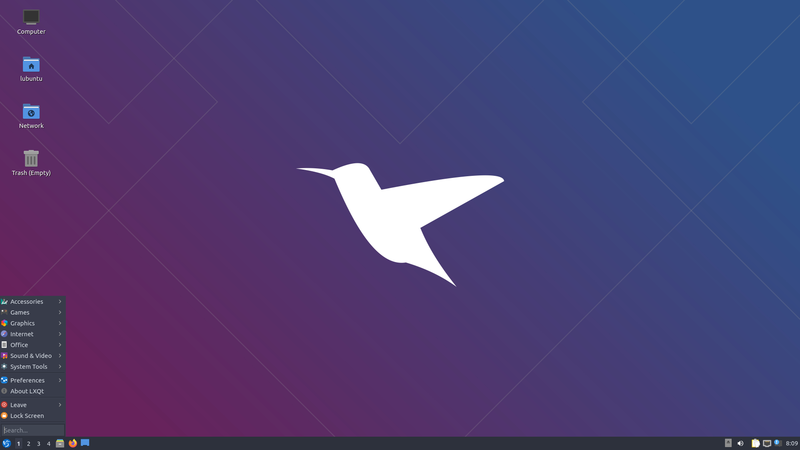

# Lubuntu RDP 

Lubuntu Ubuntu Desktop Over WSL with RDP Support , it does support docker as well. 

## Pre-Requirements:
WSL Should Be Installed.

## Easy Method:

 - Download the file `https://drive.google.com/file/d/1u_78L3IX2YMZMrPfpyqTYshSgx4qt0BS/view?usp=sharing`
 - Paste to the terminal `wsl.exe --import lubuntu . lubuntu-wsl.tar`
 - Connect via rdp user=`testuser` pwd=`1234`
Note: Nothing to worry.

 ## Build From Scrach:
  - `git clone https://github.com/0xAungkon/Lubuntu-RDP-WSL` run this
  - `cd Lubuntu-RDP-WSL` run this
  - `docker build -f Dockerfile -t docker-xrdp-lubuntu` run this
  - `docker run -dit -name lubuntu docker-xrdp-lubuntu`
  - `docker export --output=lubuntu-wsl.tar lubuntu`
  - `wsl.exe --import lubuntu . lubuntu-wsl.tar`
  - Connect via rdp user=`testuser` pwd=`1234`
  Note: Docker Must have Installed. 

  ---

#### Feel free to reach out if you have any questions or need help getting started!

Github: [https://0xaungkon.github.io/](https://0xaungkon.github.io/)

Linkedin: [https://www.linkedin.com/in/aungkon-malakar/](https://www.linkedin.com/in/aungkon-malakar/)

Facebook: [https://www.facebook.com/0xAungkon/](https://www.facebook.com/0xAungkon/)

Email: [aungkonmalakar@gmail.com](mailto:aungkonmalakar@gmail.com)
